# Full-Stack Chat App - Kubernetes Deployment

A complete three-tier chat application deployed on Kubernetes with separate frontend, backend, and database components.

## 🏗️ Architecture Overview

```mermaid
graph TB
    subgraph "Kubernetes Cluster"
        subgraph "chat-app Namespace"
            subgraph "Frontend Tier"
                FE[Frontend Pod<br/>nginx:80]
                FES[Frontend Service<br/>Port: 80]
            end
            
            subgraph "Backend Tier"
                BE[Backend Pod<br/>Node.js:5001]
                BES[Backend Service<br/>Port: 5001]
            end
            
            subgraph "Database Tier"
                DB[MongoDB<br/>Port: 27017]
                DBS[MongoDB Service<br/>Port: 27017]
            end
        end
    end
    
    subgraph "External Access"
        USER[👤 User]
        PFBE[Port Forward<br/>Backend: 5001]
        PFFE[Port Forward<br/>Frontend: 80]
    end
    
    USER --> PFFE
    USER --> PFBE
    PFFE --> FES
    PFBE --> BES
    FES --> FE
    BES --> BE
    BE --> DBS
    DBS --> DB
    FE --> BES
```



## 🚀 Quick Start

### Prerequisites
- Kubernetes cluster (kind, minikube, or cloud provider)
- kubectl configured
- Docker images available:
  - `dockerdev7nsh/chatapp-frontend`
  - `dockerdev7nsh/chatapp-backend`

### 1. Create Kubernetes Cluster (using kind)
```bash
# Create cluster with custom configuration
kind create cluster --config cluster.yaml --name main

# Verify cluster
kubectl cluster-info
kubectl get nodes
```

### 2. Deploy Application
```bash
# Clone the repository
git clone <your-repo-url>
cd full-stack_chatApp_k8s/K8s

# Create namespace
kubectl apply -f namespace.yaml

# Deploy backend
kubectl apply -f backend-deployement.yaml
kubectl apply -f service-backend.yaml

# Deploy frontend
kubectl apply -f frontend-deployement.yaml
kubectl apply -f frontend-service.yaml

# Verify deployments
kubectl get all -n chat-app
```

### 3. Access Application
```bash
# Port forward backend (API)
kubectl port-forward service/backend -n chat-app 5001:5001 --address=0.0.0.0 &

# Port forward frontend (UI)
kubectl port-forward service/chatapp-service-frontend -n chat-app 8080:80 --address=0.0.0.0 &
```

Access the application:
- **Frontend**: http://localhost:8080
- **Backend API**: http://localhost:5001

## 📁 Project Structure

```
full-stack_chatApp_k8s/
├── K8s/
│   ├── namespace.yaml              # Creates chat-app namespace
│   ├── backend-deployement.yaml    # Backend deployment (Node.js)
│   ├── service-backend.yaml        # Backend service
│   ├── frontend-deployement.yaml   # Frontend deployment (nginx)
│   ├── frontend-service.yaml       # Frontend service
│   └── cluster.yaml                # Kind cluster configuration
├── src/                           # Application source code
└── README.md                      # This file
```

## 🔧 Configuration Details

### Backend Configuration
- **Image**: `dockerdev7nsh/chatapp-backend`
- **Port**: 5001
- **Environment Variables**:
  - `PORT=5001`
  - `MONGODB_URI=mongodb://localhost:27017/chatapp`

### Frontend Configuration
- **Image**: `dockerdev7nsh/chatapp-frontend`
- **Port**: 80
- **Nginx configuration for API proxy**

### Labels & Selectors
- **Backend**: `app: chat-app-backend`
- **Frontend**: `app: chat-app-frontend`

## 🛠️ Deployment Flow


## 📋 Commands Reference

### Cluster Management
```bash
# Create cluster
kind create cluster --config cluster.yaml --name main

# Delete cluster
kind delete cluster --name main

# List clusters
kind get clusters
```

### Application Management
```bash
# Apply all configurations
kubectl apply -f .

# Check status
kubectl get all -n chat-app
kubectl get pods -n chat-app
kubectl get services -n chat-app

# View logs
kubectl logs <pod-name> -n chat-app
kubectl logs -f <pod-name> -n chat-app  # Follow logs

# Describe resources
kubectl describe pod <pod-name> -n chat-app
kubectl describe service <service-name> -n chat-app
```

### Port Forwarding
```bash
# Background port forwarding
kubectl port-forward service/backend -n chat-app 5001:5001 --address=0.0.0.0 &
kubectl port-forward service/chatapp-service-frontend -n chat-app 8080:80 --address=0.0.0.0 &

# Check running port forwards
ps aux | grep port-forward

# Stop port forwarding
kill <PID>
# or
pkill -f "kubectl port-forward"
```

### Debugging
```bash
# Check pod status
kubectl get pods -n chat-app -o wide

# Shell into pod
kubectl exec -it <pod-name> -n chat-app -- /bin/bash

# Check events
kubectl get events -n chat-app --sort-by='.lastTimestamp'

# Check resource usage
kubectl top pods -n chat-app
kubectl top nodes
```

## 🔍 Troubleshooting

### Common Issues

1. **Pod in CrashLoopBackOff**
   ```bash
   kubectl logs <pod-name> -n chat-app
   kubectl describe pod <pod-name> -n chat-app
   ```

2. **Service not accessible**
   ```bash
   # Check if service endpoints are available
   kubectl get endpoints -n chat-app
   
   # Verify label selectors match
   kubectl get pods -n chat-app --show-labels
   ```

3. **Port forward connection refused**
   ```bash
   # Check if application is listening on correct port
   kubectl exec -it <pod-name> -n chat-app -- netstat -tulpn
   ```

4. **Image pull errors**
   ```bash
   # Check if image exists and is accessible
   docker pull dockerdev7nsh/chatapp-backend
   docker pull dockerdev7nsh/chatapp-frontend
   ```

### Label Mismatch Fix
If you get "selector does not match template labels" error:
```bash
# Ensure deployment selector matches pod labels
kubectl get deployment <deployment-name> -n chat-app -o yaml
```


## 📜 License


This project is licensed under the MIT License. See the LICENSE file for more details.
